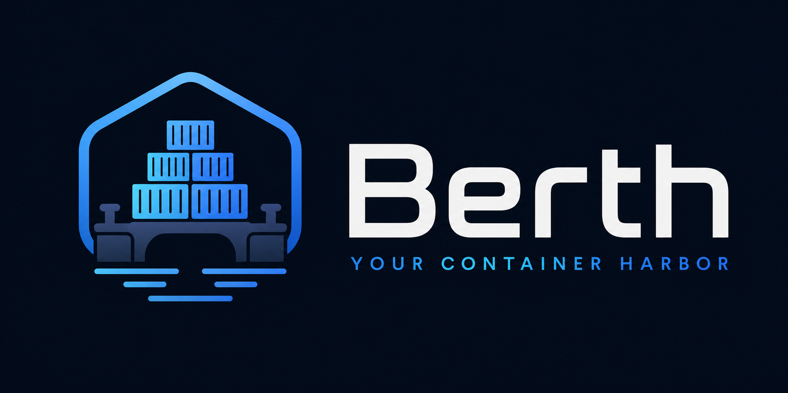
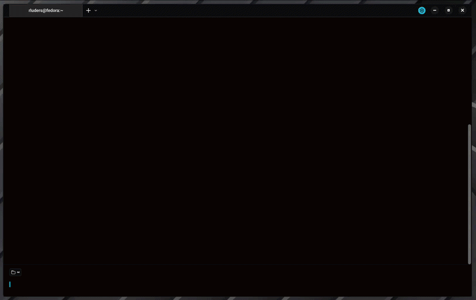

<p align="center">
  
</p>

<div align="center">

[](https://github.com/rluders/berth/actions/workflows/ci.yml)

[](https://goreportcard.com/report/github.com/rluders/berth)
[](https://github.com/rluders/berth/releases)
[](https://codecov.io/gh/rluders/berth)
[](LICENSE)
[](https://github.com/charmbracelet/bubbletea)

**Berth** is a terminal-based UI to manage your containers, images, volumes, networks, and system usage — with support for **Docker** and **Podman**. Name origin: In maritime terms, a **berth** is a designated place where a ship is docked — just like containers in your stack. Clean, organized, and under control.



</div>

## 📖 Table of Contents

- [✨ Overview](#-overview)
- [🚀 Installation](#-installation)
- [🧭 Usage](#-usage)
- [🛠️ Technology Stack](#-technology-stack)
- [📂 Project Structure](#-project-structure)
- [🚢 Release Process](#-release-process)
- [🤝 Contributing](#-contributing)
- [📜 License](#-license)

## ✨ Overview

Berth is a comprehensive terminal user interface (TUI) application built in Go, designed to simplify the management of Docker and Podman container environments. It provides a real-time, interactive experience for listing, inspecting, and controlling containers, images, volumes, and networks directly from your terminal. Berth aims to offer a `k9s`-like experience for container orchestration, focusing on usability, visual consistency, and efficient workflow.

## 🚀 Installation

### Prerequisites

-   [Go](https://golang.org/doc/install) (version 1.26 or higher recommended)
-   [Docker](https://docs.docker.com/get-docker/) or [Podman](https://podman.io/docs/installation) installed and running

### Steps

```bash
# 1. Clone the repository
git clone https://github.com/rluders/berth.git

# 2. Enter the project directory
cd berth

# 3. Build the binary
make build

# 4. Run it!
make run
```

## 🧭 Usage

Berth provides an intuitive keyboard-driven interface.

### 🎹 Global Keys

| Key       | Action              |
| --------- | ------------------- |
| `1`       | Containers view     |
| `2`       | Images view         |
| `3`       | Volumes view        |
| `4`       | Networks view       |
| `5`       | System view         |
| `?`       | Toggle help overlay |
| `q` / `esc` | Back / quit       |
| `ctrl+c`  | Quit                |

### 🛠️ Container Actions

| Key     | Action                    |
| ------- | ------------------------- |
| `enter` | Container details         |
| `s`     | Start container           |
| `x`     | Stop container            |
| `r`     | Restart container         |
| `d`     | Remove container          |
| `l`     | View logs                 |
| `i`     | Inspect container         |
| `e`     | Exec shell                |
| `/`     | Filter containers         |
| `g`     | Toggle group by compose   |
| `→`     | Expand compose group      |
| `←`     | Collapse compose group    |

### 📦 Image Actions

| Key | Action               |
| --- | -------------------- |
| `d` | Remove image         |
| `P` | Prune dangling images |
| `/` | Filter images        |

### 💾 Volume Actions

| Key | Action        |
| --- | ------------- |
| `d` | Remove volume |
| `/` | Filter volumes |

### 🌐 Network Actions

| Key | Action          |
| --- | --------------- |
| `i` | Inspect network |

### 🧼 System Cleanup

| Key | Action                                              |
| --- | --------------------------------------------------- |
| `b` | Basic cleanup — stopped containers, unused networks, dangling images |
| `a` | Advanced cleanup — basic + unused volumes           |
| `t` | Total cleanup — all unused resources                |

### 📋 Logs View

| Key | Action              |
| --- | ------------------- |
| `p` | Pause log stream    |
| `f` | Follow (tail) logs  |
| `n` | Toggle line numbers |

## 🛠️ Technology Stack

-   **Language**: [Go](https://golang.org/)
-   **TUI Framework**: [Bubble Tea](https://github.com/charmbracelet/bubbletea)
-   **Styling**: [Lipgloss](https://github.com/charmbracelet/lipgloss)
-   **Reusable TUI Components**: [Bubbles](https://github.com/charmbracelet/bubbles)

## 📂 Project Structure

```
.
├── cmd/                 # CLI entry point
├── internal/
│   ├── tui/             # Bubble Tea models, views, and components
│   ├── engine/          # Docker/Podman client abstraction
│   ├── service/         # Service layer (container, image, volume, network, system)
│   ├── controller/      # Action handlers (start, stop, remove, inspect, …)
│   └── utils/           # Formatting helpers and exec wrappers
├── docs/                # Assets (logo, screenshots)
├── go.mod
└── README.md
```

## 🚢 Release Process

Releases are fully automated via [GoReleaser](https://goreleaser.com/) and GitHub Actions.

### How to release

```bash
git tag v1.2.3
git push origin v1.2.3
```

Pushing a `v*.*.*` tag triggers the [Release workflow](.github/workflows/release.yml), which:

1. Runs all tests (`go test ./...`)
2. Builds binaries for Linux, macOS, and Windows (amd64 + arm64)
3. Packages archives (`tar.gz` for Unix, `zip` for Windows)
4. Generates `checksums.txt`
5. Publishes a GitHub Release with all artifacts

### Versioning

Follow [Semantic Versioning](https://semver.org/): `vMAJOR.MINOR.PATCH`

- Tags matching `v*.*.*-*` (e.g. `v1.0.0-rc1`) are published as **pre-releases** automatically.
- No manual draft step — releases go live immediately.

### Artifacts

| File | Description |
| ---- | ----------- |
| `berth_VERSION_linux_amd64.tar.gz` | Linux x86-64 binary |
| `berth_VERSION_linux_arm64.tar.gz` | Linux ARM64 binary |
| `berth_VERSION_darwin_amd64.tar.gz` | macOS x86-64 binary |
| `berth_VERSION_darwin_arm64.tar.gz` | macOS ARM64 binary |
| `berth_VERSION_windows_amd64.zip` | Windows x86-64 binary |
| `berth_VERSION_windows_arm64.zip` | Windows ARM64 binary |
| `checksums.txt` | SHA256 checksums for all archives |

## 🤝 Contributing

We welcome contributions to Berth! If you're interested in improving the project, please consider:

-   Reporting bugs or suggesting features via [GitHub Issues](https://github.com/rluders/berth/issues).
-   Submitting pull requests for bug fixes or new features. Please ensure your code adheres to the existing style and includes appropriate tests.

### Contributors

<div align="center">
  <a href="https://github.com/rluders/berth/graphs/contributors">
    
  </a>
</div>

Made with [contrib.rocks](https://contrib.rocks).

## 📜 License

[MIT License](LICENSE).
